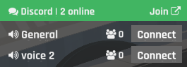

# evosc-DiscordWidget

# Installation

1. Download the [latest release](https://github.com/snixtho/evosc-DiscordWidget/releases/latest/download/DiscordWidget.zip)
2. Extract in the zip file into the `modules/` folder.
3. Restart EvoSC

## Config

### Channels
Must be an array of info about voice channels that will be displayed and tracked. The object contains the following options:

- `invite`: A link to a direct invite to the voice channel.
- `id`: The ID of the channel. (Right click -> copy ID in discord)

### Widget URL
The `url` option must contain the "JSON API" url you can find in Server Settings -> Widget. Make sure *Enable Server Widget* is on.
